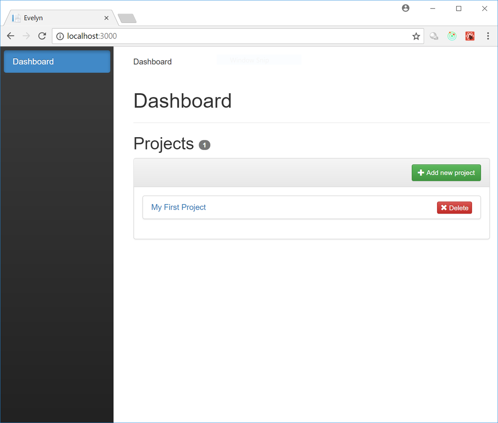

Running the management UI
=========================

Prerequisites
-------------

- You'll need to have `Node.js <https://nodejs.org>`_ installed
- The `Evelyn REST API server <https://evelyn.readthedocs.io/en/latest/>`_ must be running

Configuring
-----------

If you are running the default configuration of the sample Evelyn REST API server then you shouldn't have to make any changes to the management UI configuration. Otherwise, you might need to change where the management UI is trying to access the REST API server - this is currently hard-coded in ``./src/api.js``.

Running
-------

- install the package dependencies required by the application
  - ``npm install``
- run the application
  - ``npm start``

The development server will start and open up a browser window with the management UI:

